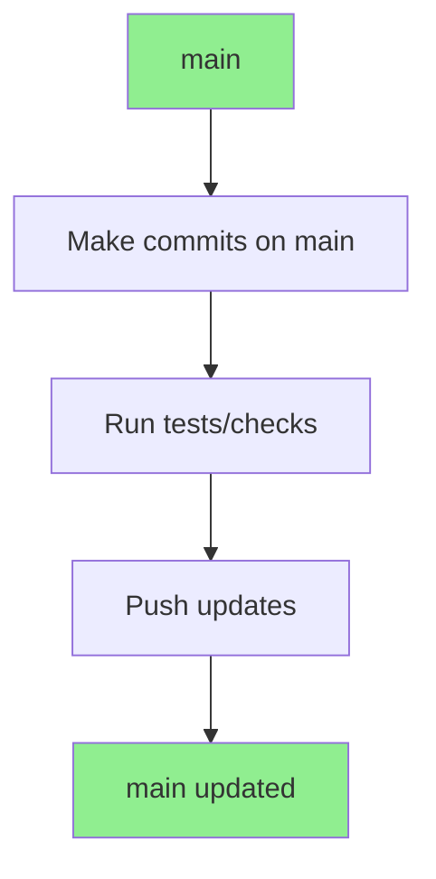

# Git Workflow

This repo has no prescribed branching or worktree strategy.

```mermaid
flowchart TB
    main1["main"] --> commit["Make commits on main"]
    commit --> checks["Run tests/checks"]
    checks --> push["Push updates"]
    push --> main2["main updated"]

    style main1 fill:#90EE90
    style main2 fill:#90EE90
```

## Rules

- Default: work on `main`.
- Only create/use a branch or `git worktree` if explicitly requested.
