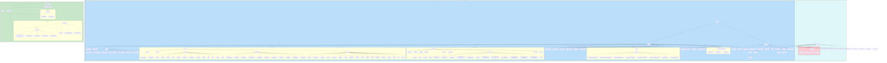

# Mermaid Diagram

```mermaid
graph TD
    %% Repository Structure
    subgraph trr-app
        appRoot[trr-app]
        appRoot --> firebaseConfig[.firebaserc]
        appRoot --> gitignore[.gitignore]
        appRoot --> makefile[Makefile]
        appRoot --> repoStructure[REPO_STRUCTURE.md]

        subgraph GitHubWorkflows
            workflows[.github]
            workflows --> firebaseRules[firebase-rules.yml]
            workflows --> repoMap[repo_map.yml]
            workflows --> webTests[web-tests.yml]
        end
        appRoot --> workflows

        subgraph Apps
            apps[apps]
            apps --> vueWordle[vue-wordle]
            vueWordle --> indexHtml[index.html]
            vueWordle --> packageLock[package-lock.json]
            vueWordle --> packageJson[package.json]
            vueWordle --> srcDir[src]
            srcDir --> appVue[App.vue]
            srcDir --> mainTs[main.ts]
            srcDir --> envD[env.d.ts]
            srcDir --> stylesDir[styles]
            stylesDir --> wordleCss[wordle.css]
            vueWordle --> tsconfig[tsconfig.json]
            vueWordle --> tsconfigNode[tsconfig.node.json]
            vueWordle --> tsconfigTsBuild[tsconfig.tsbuildinfo]
            vueWordle --> viteConfig[vite.config.ts]

            apps --> web[web]
            web --> webGitignore[.gitignore]
            web --> DEPLOY[DEPLOY.md]
            web --> POSTGRES_SETUP[POSTGRES_SETUP.md]
            web --> README[README.md]
            web --> SURVEYS_SETUP[SURVEYS_TABLE_SETUP.md]

            subgraph webDb
                db[db]
                db --> migrations[migrations]
                migrations --> createSurveysTable[000_create_surveys_table.sql]
                migrations --> seedSurveys[000_seed_surveys.sql]
                migrations --> createProfileResponses[001_create_global_profile_responses.sql]
                migrations --> createRhoslcResponses[002_create_rhoslc_s6_responses.sql]
                migrations --> createSurveyXResponses[003_create_survey_x_responses.sql]
                migrations --> addUsernameColumn[004_add_app_username_column.sql]
                migrations --> makeFieldsNullable[005_make_survey_x_show_fields_nullable.sql]
                migrations --> createRhopResponses[006_create_rhop_s10_responses.sql]
            end
            web --> db

            web --> eslintConfig[eslint.config.mjs]
            web --> nextConfig[next.config.ts]
            web --> packageLockWeb[package-lock.json]
            web --> packageJsonWeb[package.json]
            web --> pnpmLock[pnpm-lock.yaml]
            web --> postcssConfig[postcss.config.mjs]

            subgraph webPublic
                public[public]
                public --> assets[assets]
                assets --> icons[icons]
                public --> fileSvg[file.svg]
                public --> fonts[fonts]
                fonts --> gloucesterRegular[Gloucester OS MT Std Regular.otf]
                fonts --> gloucesterRegularWoff[Gloucester OS MT Std Regular.woff]
                fonts --> gloucesterRegularWoff2[Gloucester OS MT Std Regular.woff2]
                fonts --> gloucesterBold[gloucester-bold-font-book]
                fonts --> gloucesterCondensed[gloucester-condensed-font-book]
                fonts --> gloucesterGoodall[gloucester-goodall-font-book]
                fonts --> monotype[monotype]
                fonts --> plymouth[plymouth-serial-font-book]
                fonts --> realitease[realitease]
                fonts --> rudeSlab[rude-slab-condensed-font-book]
                public --> globeSvg[globe.svg]
                public --> iconsPublic[icons]
                iconsPublic --> bravodleIcon[Bravodle-Icon.svg]
                iconsPublic --> realiteaseIcon[Realitease-Icon.svg]
                iconsPublic --> realationsIcon[realations-icon.svg]
                public --> images[images]
                images --> logos[logos]
                images --> realiteaseImages[realitease]
                images --> shows[shows]
                public --> nextSvg[next.svg]
                public --> vercelSvg[vercel.svg]
                public --> windowSvg[window.svg]
            end
            web --> public

            subgraph webScripts
                scripts[scripts]
                scripts --> checkSurveyX[check-survey-x.mjs]
                scripts --> checkSurveys[check-surveys.mjs]
                scripts --> runMigrations[run-migrations.mjs]
            end
            web --> scripts

            subgraph webSrc
                src[src]
                src --> app[app]
                app --> admin[admin]
                app --> api[api]
                app --> auth[auth]
                app --> bravodle[bravodle]
                app --> favicon[favicon.ico]
                app --> globals[globals.css]
                app --> hub[hub]
                app --> layout[layout.tsx]
                app --> login[login]
                app --> page[page.tsx]
                app --> privacyPolicy[privacy-policy]
                app --> profile[profile]
                app --> realations[realations]
                app --> realitease[realitease]
                app --> sideMenu[side-menu.css]
                app --> surveys[surveys]
                app --> termsOfSale[terms-of-sale]
                app --> termsOfService[terms-of-service]
                app --> testAuth[test-auth]
                
                src --> components[components]
                components --> authRedirect[AuthRedirect.tsx]
                components --> clientAuthGuard[ClientAuthGuard.tsx]
                components --> clientOnly[ClientOnly.tsx]
                components --> debugPanel[DebugPanel.tsx]
                components --> errorBoundary[ErrorBoundary.tsx]
                components --> gameHeader[GameHeader.tsx]
                components --> globalHeader[GlobalHeader.tsx]
                components --> sideMenuProvider[SideMenuProvider.tsx]
                components --> signOutButton[SignOutButton.tsx]
                components --> toastHost[ToastHost.tsx]
                components --> flashbackRanker[flashback-ranker.tsx]

                src --> lib[lib]
                lib --> adminLib[admin]
                lib --> bravodleLib[bravodle]
                lib --> data[data]
                lib --> dbLib[db]
                lib --> debug[debug.ts]
                lib --> firebase[firebase.ts]
                lib --> firebaseAdmin[firebaseAdmin.ts]
                lib --> preferences[preferences.ts]
                lib --> realiteaseLib[realitease]
                lib --> server[server]
                lib --> surveysLib[surveys]
                lib --> validation[validation]

                src --> signup[signup]
                signup --> signupPage[page.tsx]

                src --> styles[styles]
                styles --> componentsCss[components.css]
                styles --> realiteaseFonts[realitease-fonts.css]
            end
            web --> src

            web --> tests[tests]
            tests --> finishFlowTest[finish.flow.test.tsx]
            tests --> profileTest[profile.test.ts]
            tests --> registerFlowTest[register.flow.test.tsx]
            tests --> registerValidationTest[register.validation.test.ts]
            tests --> ssrGuardsTest[ssr.guards.test.ts]
            tests --> usersIntegrationTest[users.integration.test.ts]
            tests --> validationTest[validation.test.ts]
            web --> tsconfigWeb[tsconfig.json]
            web --> vitestConfig[vitest.config.ts]
        end
    end

    appRoot --> copyFonts[copy-fonts.sh]

    subgraph Docs
        docs[docs]
        docs --> repoDocs[Repository]
        repoDocs --> repoReadme[README.md]
        repoDocs --> workflowSetup[WORKFLOW_SETUP.md]
        
        subgraph diagramsSub
            diagrams[diagrams]
            diagrams --> gitWorkflow[git_workflow.md]
            diagrams --> systemMaps[system_maps.md]
        end
        repoDocs --> diagramsSub

        subgraph generatedSub
            generated[generated]
            generated --> gitKeep[.gitkeep]
            generated --> codeImportGraph[CODE_IMPORT_GRAPH.md]
            generated --> scriptsFlow[SCRIPTS_FLOW.md]
            
            subgraph renderedSub
                rendered[rendered]
                rendered --> codeImportGraphSvg[CODE_IMPORT_GRAPH-1.svg]
                rendered --> scriptsFlowSvg[SCRIPTS_FLOW-1.svg]
                rendered --> gitWorkflowSvg[git_workflow-1.svg]
                rendered --> systemMapsSvg1[system_maps-1.svg]
                rendered --> systemMapsSvg2[system_maps-2.svg]
            end
            generated --> renderedSub
        end
        repoDocs --> generatedSub
    end

    appRoot --> firebaseJson[firebase.json]
    appRoot --> firestoreRules[firestore.rules]
    appRoot --> packageLock[package-lock.json]
    appRoot --> packageJson[package.json]
    appRoot --> requirements[requirements.txt]
    appRoot --> ruffConfig[ruff.toml]
    appRoot --> scripts[generate_repo_mermaid.py]
    
    style trr-app fill:#e0f7fa,stroke:#333,stroke-width:2px;
    style GitHubWorkflows fill:#ffcdd2,stroke:#333,stroke-width:2px;
    style Apps fill:#bbdefb,stroke:#333,stroke-width:2px;
    style Docs fill:#c8e6c9,stroke:#333,stroke-width:2px;
```